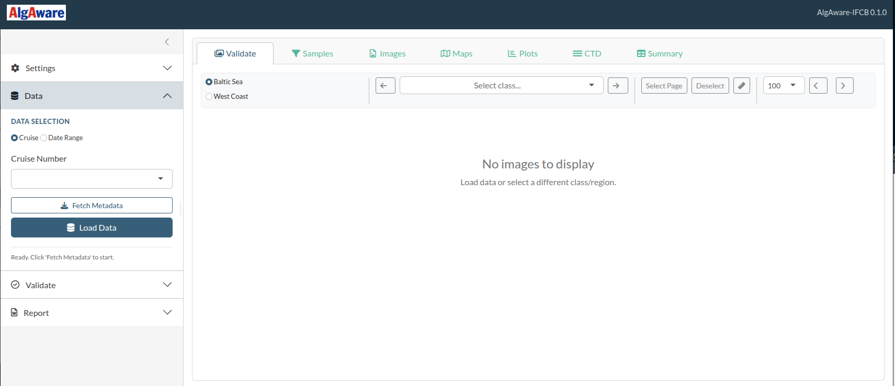
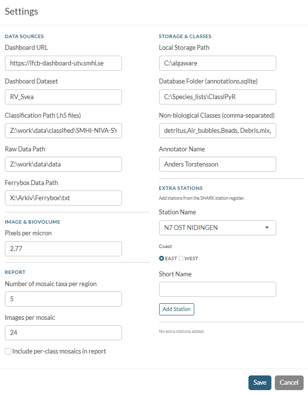

```{r setup, include=FALSE}
knitr::opts_chunk$set(echo = TRUE, eval = FALSE)
```

This guide covers everything you need to do before using AlgAware-IFCB for the
first time. You will install R, RStudio, and the package, then configure the
application for your cruise data.

---

## 1. Install R and RStudio

If you do not already have R and RStudio installed:

1. Download R from <https://cran.r-project.org/> and run the installer.
2. Download RStudio Desktop (free) from <https://posit.co/download/rstudio-desktop/> and run the installer.

You only need to do this once.

---

## 2. Install the AlgAware-IFCB package

Open RStudio and paste the following into the **Console** panel (bottom-left),
then press Enter:

```{r install}
install.packages("remotes")
remotes::install_github("anderstorstensson/shiny-ifcb-algaware",
                        dependencies = TRUE)
```

The `dependencies = TRUE` argument ensures all optional packages are installed
alongside the main package. Installation may take a few minutes the first time.

> **Note for Linux users:** Some system libraries must be installed before the
> R packages will compile. On Ubuntu/Debian, run the following in a terminal:
> ```
> sudo apt-get install libhdf5-dev libudunits2-dev libgdal-dev libgeos-dev \
>   libproj-dev libmagick++-dev
> ```

---

## 3. Launch the application

```{r launch}
library(algaware)
launch_app()
```

The application opens in your default web browser. Leave the RStudio window
open — closing it will stop the app.



---

## 4. Configure settings

Click the **Settings** tab in the left sidebar. You must fill in the paths and
connection details before the app can load any data.



| Field | What to enter | Example |
|-------|--------------|---------|
| **Dashboard URL** | Base URL of the IFCB Dashboard instance | `http://ifcb-dashboard-utv.smhi.se/` |
| **Dashboard Dataset** | Dataset name as it appears in the Dashboard | `RV_Svea` |
| **Classification Path** | Folder containing the HDF5 (`.h5`) classifier output files | `C:/Users/name/classifications` |
| **FerryBox Data Path** | Folder with FerryBox `.csv` files (optional) | `C:/Users/name/ferrybox` |
| **Local Storage Path** | Where downloaded IFCB data will be cached on your computer | `C:/Users/name/algaware_data` |
| **Database Folder** | Where the annotations SQLite file will be stored | `C:/Users/name/algaware_db` |
| **Non-biological Classes** | Comma-separated class names excluded from all analyses | `detritus,Air_bubbles,Beads,Debris,mix,mixed` |
| **Pixels per Micron** | Calibration factor for the IFCB camera | `2.77` |

Click **Save Settings** when done. Settings are stored in
`~/.config/R/algaware/settings.json` and reloaded automatically next time you
launch the app.

### Adding monitoring stations from SHARK

If your cruise visited stations not yet in the built-in list, you can add them
from the SHARK station register:

1. In the Settings panel, click **Load stations from SHARK**.
2. The app downloads the current station list from SHARK and merges it with
   the built-in AlgAware stations.
3. Newly added stations will appear in all spatial-matching and reporting
   functions.

> **Note for package maintainers:** Stations that should be permanently
> bundled in the package (rather than fetched at runtime) need to be added to
> `inst/stations/algaware_stations.tsv`. See the section
> [Bundled configuration files](#bundled-configuration-files) below.

---

## 5. Configure LLM API keys (optional)

AlgAware-IFCB can generate Swedish and English report text automatically using
OpenAI (GPT-4.1) or Google Gemini. This requires an API key from the respective
provider and the `httr2` package (installed with `dependencies = TRUE`).

### Set up the key in RStudio

Open your `.Renviron` file by running:

```{r renviron}
usethis::edit_r_environ()
```

Add one of the following lines (replace the placeholder with your actual key):

```
OPENAI_API_KEY=sk-proj-xxxxxxxxxxxxxxxxxxxxxxxx
```

or

```
GEMINI_API_KEY=AIzaxxxxxxxxxxxxxxxxxxxxxxxxxxxxxxx
```

Save the file, then restart R (Session → Restart R in RStudio). The key will
be available to AlgAware-IFCB every time you launch the app.

If both keys are set, OpenAI is used by default. Override the model by adding:

```
OPENAI_MODEL=gpt-4.1
GEMINI_MODEL=gemini-2.5-flash
```

> **Security:** Never share your `.Renviron` file or paste your API key into
> chat or email.

---

## Bundled configuration files {#bundled-configuration-files}

AlgAware-IFCB ships several data files in `inst/extdata/` and
`inst/stations/` that control how stations, taxa, and plots are handled.
A package maintainer can edit these files and rebuild the package to change
default behaviour without touching any R code.

### `inst/stations/algaware_stations.tsv`

Defines the 12 AlgAware monitoring stations used for spatial bin-matching and
the chlorophyll map. Each row is one station:

| Column | Description |
|--------|-------------|
| `STATION_NAME` | Full canonical name (must match SHARK) |
| `COAST` | `EAST` (Baltic Sea) or `WEST` (West Coast) |
| `STATION_NAME_SHORT` | Short label shown in plots and reports |

To add a new AlgAware station, append a row and rebuild the package with
`devtools::install()`.

### `inst/extdata/standard_stations.yaml`

Lists all standard Swedish monitoring stations (not just AlgAware) used for
CTD profile matching and the regional chlorophyll time series. Stations are
grouped by region:

```yaml
standard_stations:
  station_list: ["FLADEN", "ANHOLT E", ...]
  FLADEN: "The Kattegat and The Sound"
  ANHOLT E: "The Kattegat and The Sound"
```

To add a station to a CTD region, add its name to `station_list` **and** add
a `StationName: "Region name"` line. Existing region names are:
`The Skagerrak`, `The Kattegat and The Sound`, `The Southern Baltic`,
`The Western Baltic`, `The Eastern Baltic`.

### `inst/extdata/station_mapper.txt`

A tab-delimited synonym table mapping raw station name variants (as they
appear in CNV file headers or LIMS exports) to the canonical station names
used in `standard_stations.yaml`. Columns: `synonym`, `statn`.

If a new station's raw name in CNV files differs from its canonical name,
add a row here. Names are matched case-insensitively, with prefix matching as
a fallback.

### `inst/extdata/taxa_lookup.csv`

Maps classifier class names to display names, WoRMS AphiaIDs, HAB flags,
and italic/non-italic formatting. Edit this file to add new taxa, rename
display labels, or update HAB status.

### `inst/extdata/annual_1991-2020_statistics_chl20m.txt`

Historical monthly Chl-a statistics (mean ± std dev) for each standard station,
used as a climatological reference in the CTD time-series panels. Update this
file when a new climatological period is adopted.

### `inst/extdata/report_writing_guide.md`

The system prompt sent to the LLM when generating report text. Edit this file
to adjust tone, style, or content requirements for AI-generated summaries and
station descriptions.
